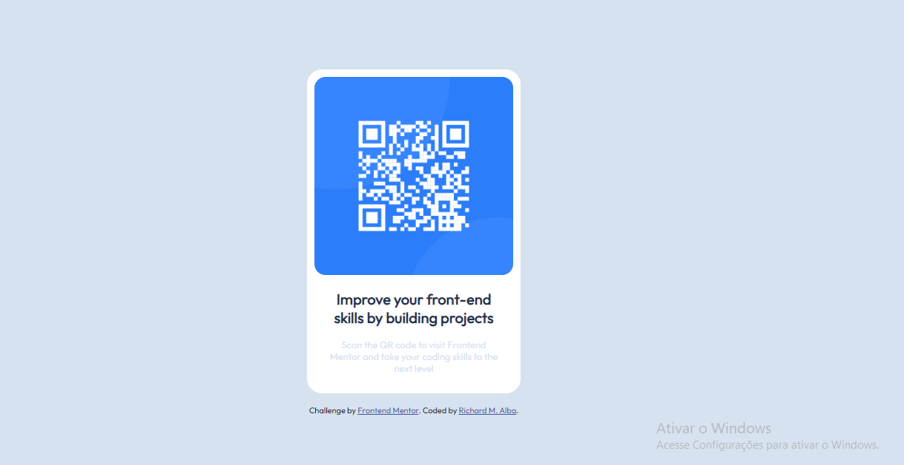

# Frontend Mentor - QR code component solution

Esta é uma solução para o [desafio do componente de código QR no Frontend Mentor](https://www.frontendmentor.io/challenges/qr-code-component-iux_sIO_H). Os desafios do Frontend Mentor ajudam você a melhorar suas habilidades de codificação criando projetos realistas.

## Índice

- [Overview](#Overview)
     - [Screenshot](#screenshot)
     - [Links](#links)
- [My process](#my-process)
     - [Built with](#built-with)
     - [What I Learned](#What-I-Learned)
     - [Continuous Development](#Continuous-Development)

## Overview

### screenshot



### Links

h - Solution URL: [https://www.w3schools.com/w3css/w3css_responsive.asp]
- - Live Site URL: [https://github.com/rmaxyz/qr-code-component-main]

## My process

### Built with

- Semantic HTML5 markup
- CSS custom properties
- Mobile-first workflow

### What I learned

I learned today that I should avoid setting heights in my CSS as it loses responsiveness. Using percentage in widths relative to the parent is a good way to work responsive. I learned to use (rem) for full width as it improves user experience changing device/browser font size. I also learned to avoid using px for font-size, so in this project and in the future I will use rem for font-size.

```<body>
  <div class="conteiner">

    <div class="content">
       
      <h1>Improve your front-end skills by building projects </h1>
      <p>Scan the QR code to visit Frontend Mentor and take your coding skills to the next level</p>
    </div>

  </div>

  <div class="attribution">
    Challenge by <a href="https://www.frontendmentor.io?ref=challenge" target="_blank">Frontend Mentor</a>.
    Coded by <a href="#">Richard M. Alba</a>.
  </div>
</body>
```
```css
* {
    margin: 0;
    padding: 0;
    box-sizing: border-box;
}

body {
    background-color:hsl(212, 45%, 89%);
    height: 100vh;
    display: flex;
    justify-content: center;
    align-items: center;
    flex-direction: column;
    font-family: 'Outfit', sans-serif;

}

.conteiner {
    background-color: hsl(0, 0%, 100%);
    max-width: 18rem;
    margin: 1rem auto;
    border-radius: 20px;
    padding: 10px;
}

.content{
    align-items: center;
}

.content img {
    max-width: 100%;
    border-radius: 15px; 
}

.content h1 {
    color: hsl(218, 44%, 22%);
    text-align: center;
    padding: 1rem 0.8rem;
    font-weight: 800;
    font-size: 1.25rem;
}

.content p {
    color: hsl(212, 45%, 89%);
    font-size: 0.8rem;
    margin: 0 1rem 1rem;
    text-align: center;
}


.attribution { 
    font-size: 11px; text-align: center; 
}

.attribution a {
     color: hsl(228, 45%, 44%); 
    }
```

### Continued development

Day one started (09.08.2023) and already day one helped me extremely by understanding that CSS is responsive by default and we are mainly causing the problems of the responsive threatment of CSS. 


